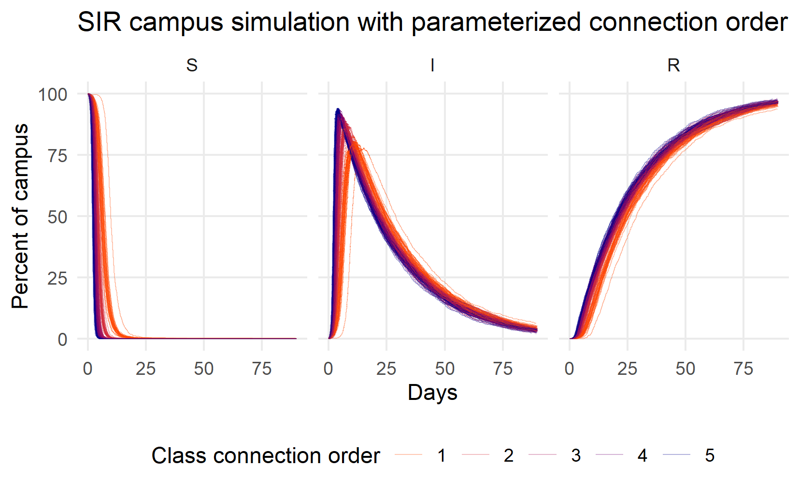
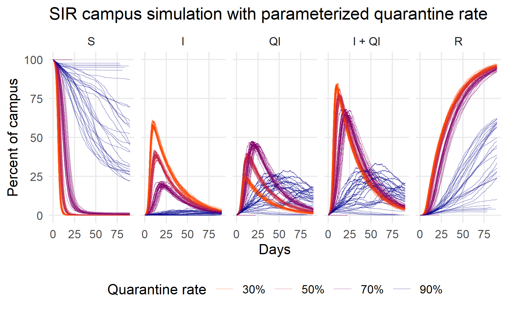
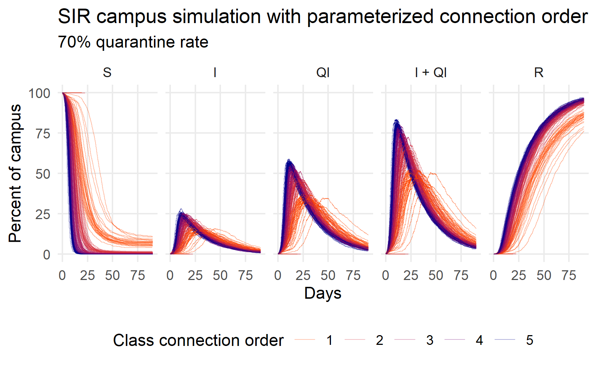

```{r setup, include=FALSE}
knitr::opts_chunk$set(echo = FALSE)
```


. Used with permission](CrocodileDreaming1B.jpg)


In my [last post](../2021-02-18-dynamic-network-visualization/index.html), I shared some dynamic network animations.  Making these little movies, for all their flaws and simplifications, felt like broadly plausible representation of campus life.   But they didn't help me understand the mechanics of the  *flatten the curve* verbiage that everyone was using.  Intuitively, I understood that by social distancing, we would reduce the density of our social networks and transmission risks would be mitigated.  But how do they know it will work?  It feels like a very blunt tool.  Is quarantine and lock down enough?  What if, as many news agencies told us, many of the sick are asymptomatic?   What about the herd immunity approach?  How much immunity would we need? 

I did a little bit of reading into what epidemiologists do.  I had several friends studying epidemiology in graduate school but we didn't talk much about what they studied.  Now I really wanted to know: How do epidemiologists generate forecasts? How do they know where herd?  The simplest model I could find was the, so called, [Susceptible, Infected, or Recovered](https://en.wikipedia.org/wiki/Compartmental_models_in_epidemiology) model.  The dynamics, at least in the most elementary presentations, didn't seem too crazy complicated... so I had a go!  

As a reminder, I'm not an epidemiologist and I'm not claiming that my work is in any way authoritative.  This exercise was primarily about satisfying my curiosity, ordering my thoughts, and preserving my sanity at the beginning of the pandemic.  With my disclaimer out of the way, on with the show!

As a starting point, I used the [campus model](../2021-02-18-dynamic-network-visualization/index.html) and assumptions I built before and wrapped it in a 90 day simulation.  My previous model simulated 3 days and instantaneous incubation so there wasn't really time for anyone to recover.  At the time, I was reading about people taking 14 days to recover (distributed exponentially).  For each simulation, I re-drew the campus and tried different degrees of connection within the classroom.  You may recall that I had assumed that everyone in a class is sitting in a circle and connected to people two seats away.  Well, what if that was only one seat away.  What if it was more?  How does the density of the classroom affect viral transmission?  


```{r, fig.cap = "Simulating Susceptible (S), Infected (I), and Recovered (R) individuals while varying classroom connections"}

```

In this first round of 120 simulations (they take a long time to run!), I vary the order of classroom connections from 1 (people are connected to those sitting directly next to them in the circle) to 5 (people are connected to others up to 5 seats away). The different connection scenarios appear as different colors in the graphic from indigo (connection order 1) to orange (connection order 5).  The three panels show the size of the Susceptible (S), Infected (I), and Recovered (R) populations over a 90 day period.  

A few things struck me about this image.  First, almost the whole campus was going to be infected very quickly - within a week or so!  You can see the Susceptible lines nose dive into the horizontal axis.  Second, what herd immunity??  I don't see any herd immunity, except at or very close to 100%.  Third, the infected curve is not flat at all.  It is sharp like a thumbtack. only connection order 1 seems to flatten the Infected curve at all. At best, peak infections would appear after 2 weeks. It seemed to me that, if we didn't do anything as a campus, things could get bad very quickly unless we did some aggressive social distancing.


Now, what if we did something with the sick?  Presumably they won't just keep coming to class...  What if we could isolate and quarantine the sick?  Could we arrest the spread?  How much does quarantine help?  What about the asymptomatic spreaders?  So I ran another simulation, this time I fixed the class connection order at 2 (like my last post) and varied the number of infected people that are quarantined.


```{r, fig.cap = "Simulating Susceptible (S), Infected but not qurantined (I), Quarantined (Q), all infected (Q+I), and Recovered (R) individuals while varying the proportion of infected successfully quarantined"}

```

So quarantine can help a lot! But, like social distancing, only if it's precise and aggressive.  At 70%, the peak of I+Q curve is at 25 days, maybe 2 weeks later than the peak under the 30% and 50% peaks.  At 90%, the infection peak can be delayed a month or more.  You can start to see some herd immunity, too, as the number of Susceptible people manages to stay above horizontal axis.  

There are still issues, though.  First, 90% felt unrealistic, even with vigorous contact tracing, since several news reports were saying 30% of infections are asymptomatic.  Second, herd immunity in some of the simulations was around  75% of the population.  That would be painful.  What would happen if we combined social distancing with quarantine?  If we could quarantine a reasonably high proportion of the sick, how much does class order matter?


```{r, fig.cap = "Simulating Susceptible (S), Infected but not qurantined (I), Quarantined (Q), all infected (Q+I), and Recovered (R) individuals while varying the class connection order"}

```

For this simulation, I assumed that 30% of the infected are asymptomatic or otherwise undetected: a 70% quarantine rate.  The picture is still pretty bleak.  Almost everyone gets sick.  Quarantine is certainly more effective than social distancing but social distancing can make a difference.  The Q+I orange lines (connection order 1) peak at around 25 days and at lower levels than at higher connection orders (50% of the population is sick, rather than 75%). 

The real situation would likely not be this bad, though. Don't forget that I assumed instantaneous incubation and I did not modify random outside-of-class gatherings or sleeping patterns.  Where you go at night turns out to be quite important because I assume that faculty interact with the community every night when they go home.  The effect isn't huge, though.  This little exercise, despite its many shortcomings and my own ignorance, convinced me that social distancing, quarantine, and contact tracing can indeed *flatten the curve* and slow the spread of the virus.  It also convinced me that the aggressive, consistent, and precise mitigation can have significant effects.  We do have some tools but we need to be coordinated and consistent for them to work.  At the end of it all, my thoughts felt less crazy, less scattered.  I even felt a little bit empowered.  Well, just a little bit.