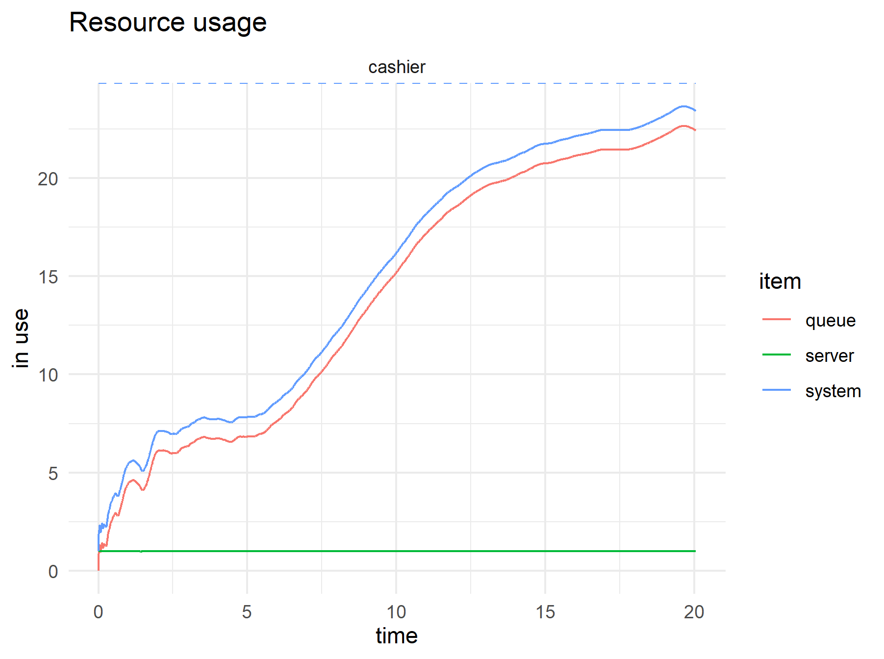
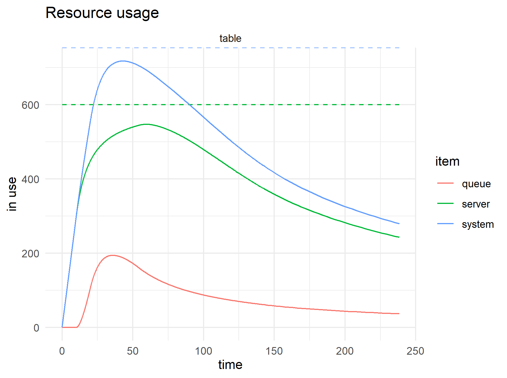
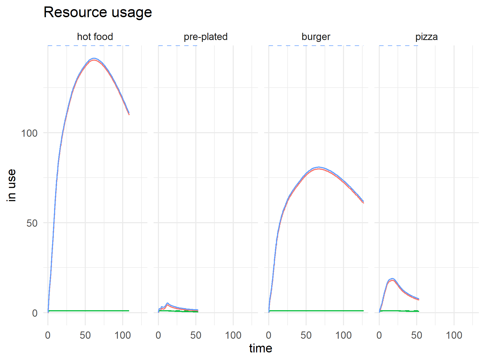
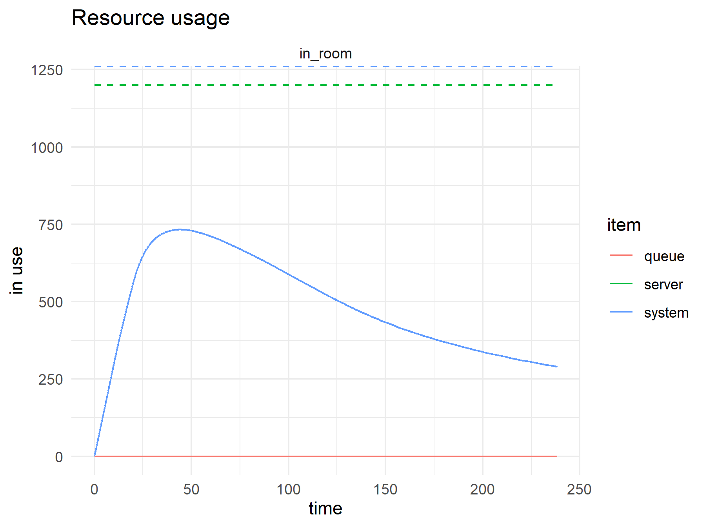
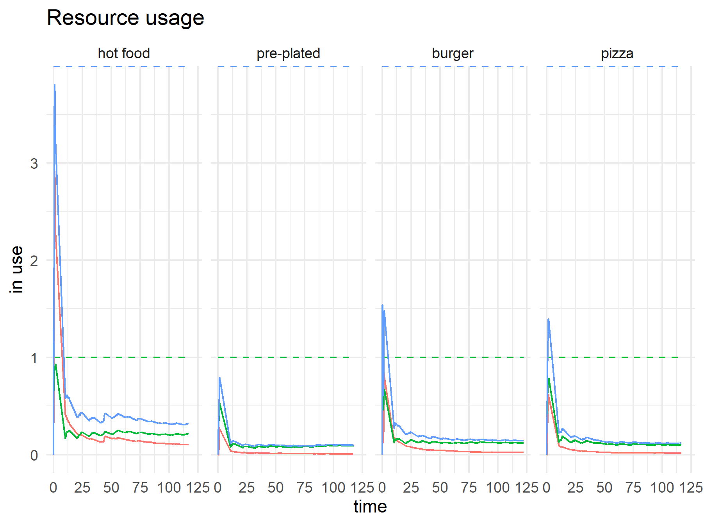
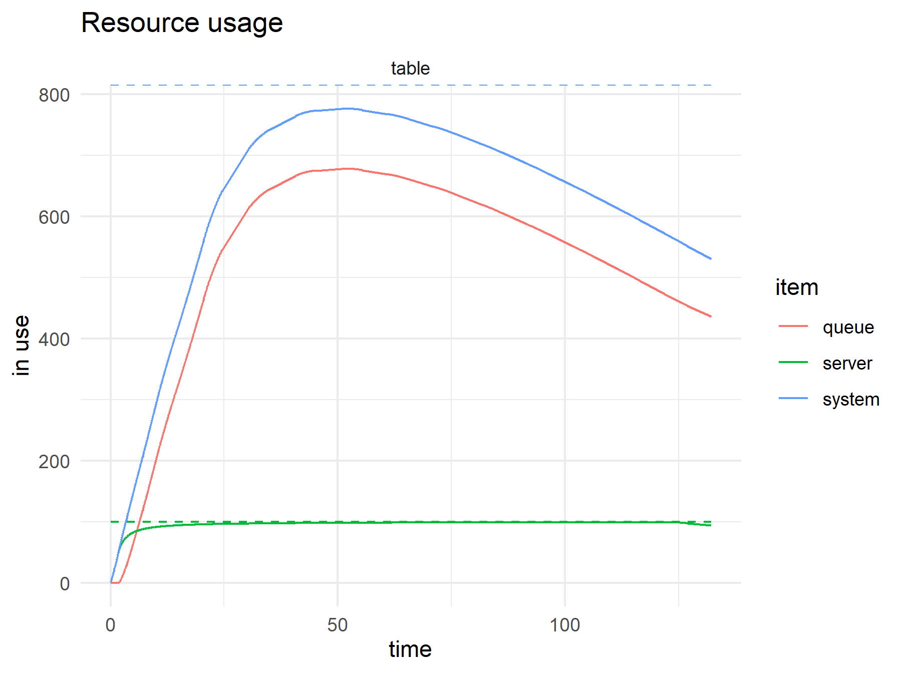
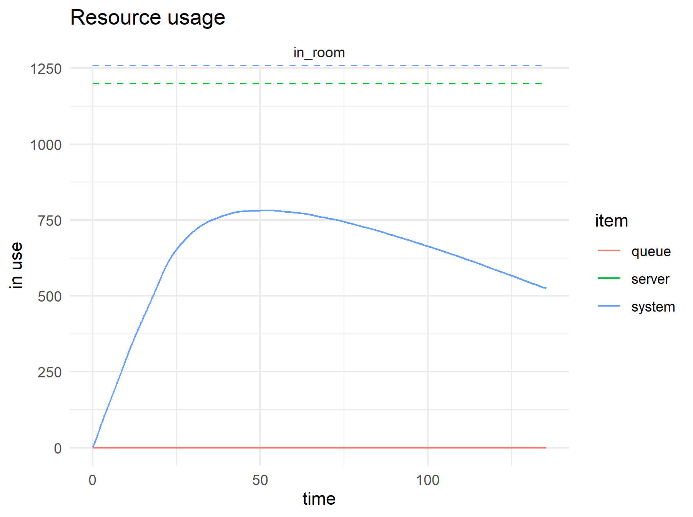

```{r setup, include=FALSE}
knitr::opts_chunk$set(echo = FALSE)
```

. Used with permission](waterholes_k947.jpg)

In my last two posts, I was focusing mostly on classrooms and dorms. These results had me satisfied for the last few weeks of the semester. yet, in the back of my mind were its obvious simplifications. Specifically, I was thinking of daily whole-campus gatherings like chapel and meals. The trickier of these was the cafeteria, since people gotta eat.

During the summer, the administration was talking about implementing a "to-go only" strategy for the cafeteria, where students would pick up pre-made lunches to eat elsewhere on campus. Our campus only has one cafeteria, so lunchtime can be a pretty hectic affair but at the same time, it felt a bit arbitrary since classes would continue to be held in person, and dorms seemed more problematic. Plus, at the time, there was a scary [video](https://youtu.be/OOvENoZMmK4) going viral that illustrated how quickly germs can spread during a meal.

I wanted to know, what a milder set of restrictions would look like. What if we served meals rather than have diners serve themselves and limited the number of tables to allow for social distancing.

This time, I built a little discrete event simulation using the [`simmer`](https://r-simmer.org/) package. This was my first time using this package, having been more of an [Arena](https://www.arenasimulation.com) person in my past life. To my delight, this packages was super intuitive and easy to use even if it didn't come with fun animations.

### Assumptions

As before, the setup is based on my own anecdotal experience at the Dining Commons.

-   1200 diners

-   Diners would arrive at an average rate of about 1 per second (I assumed exponential processing throughout)

-   Diners spend about 1 second with the cashier

-   Diners first scout out one of 600 chairs and drop their bags

Once in the dining room, there are 8 food stations

| Station                   | Probability of visit | Average time at station |
|---------------------------|----------------------|-------------------------|
| Hot food                  | 25                   | 20                      |
| pre-plated                | 12                   | 10                      |
| Burgers                   | 14                   | 45                      |
| Pizza                     | 12                   | 15                      |
| Salad                     | 12                   | 60                      |
| Sandwich                  | 9                    | 180                     |
| Gluten free               | 1                    | 10                      |
| International (side room) | 15                   | 30                      |

: Food stations

I also assumed 2 drink stations where diners required 10 seconds to get a drink.

Diners would need 10 minutes to scarf down their food before packing up their belongings. Before they leave, though, some visit the bathroom before busing their plate (average time of 10 seconds) and leaving.

I went a little bit bonkers with the bathroom. I assumed 50% of of diners would visit the bathroom. Of these bathroom-goers, 70% had to go \#1. Men were a bit quicker at going \#1 at 1 minute, while women would take 2 minutes. Just a guess. 30% had to go \#2 and everyone took 4 minutes to go.

### Runtime

I didn't think through the dynamics of the situation. I just plugged these parameters in and let it run.

It was a lot of fun simulating this model. I printed fun little flags at each event. Here's the trajectory diner 65. The numbers in the first column are minutes.

    0.97805: diner65: I'm hungry!
    1.10189: diner65: Found a table - plonk bags
    1.10189: diner65: I'm going to the side-room station
    3.05: diner65: I want a drink
    3.18333: diner65: Nom nom nom
    13.1833: diner65: I need to go to the little boys room - No.2
    17.1833: diner65: Bussing my plate
    19.35: diner65: Bye!

Fun!

### Baseline

Even though my assumptions were crude, the output felt about right. Here's a run:

There's often a queue at the cashier but since the processing time is fast, it moves quickly.



If you don't go early, it can be hard to find a table.



The line for hot food is ridiculous.



The room gets full very quickly.



The numbers felt about right.

### Served food rather than buffet style

So, what would happen if, instead of the scary buffet style we were used to, we employed super servers that would quickly serve food at each station (like, 5 seconds fast) but reduced the number of tables?

Well, things didn't turn out so great. Sure, we eliminated the lines at the food stations...



But we make the hunt for a table much harder...

... and we barely make a dent in the number of people in the room.

Ultimately, unless we could make people eat faster, super fast servers won't help so you're better off sending diners outside as planned. Take-out is better.
