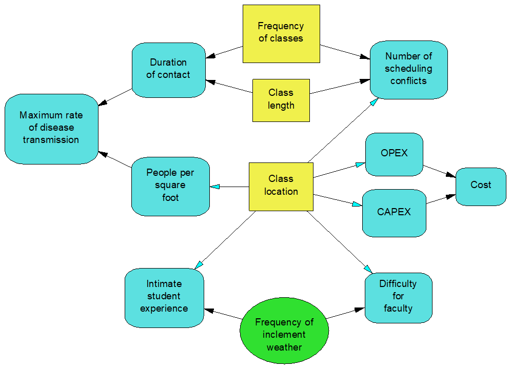

```{r setup, include=FALSE}
knitr::opts_chunk$set(echo = FALSE)
```


. Used with permission.](rain_sarrita_king.jpg)


At the beginning of the Summer 2020, I offered to help the administration with some of its decision making.  Hopefully I wasn't seen as being bossy or demanding. Some of the models got active use, others got a little conversation going, and others didn't really get much of a reaction.  Curiously, today's post is about a model that I personally found most helpful but happened to fall into this last bucket.

Influence diagrams are one of my favorite Decision Analytic tools.  By naming values, alternatives, and uncertainties, they bring complex problems into sharp focus and force decision makers to wrestle with the structure of the decision problem.  When I'm faced with an intimidating decision problem, I almost always start thinking in influence diagrams.  I may even reach for my favorite decision analytic software package, [DPL](https://www.syncopation.com/).

When I imagined the administration's desire to repopulate the campus in the Summer, this is exactly what I did.  I started by building some high level influence diagrams to think through the various functions and values of the college as whole. Some lower level models to imagine specific programs and activities. 

```{r, fig.cap = "Classroom decisions"}

```

Here's one that describes some initial thoughts on classrooms.  I *hope* this helped the college frame later decisions related to classroom capacity, utilizing outdoor spaces under tents, identifying new spaces, equipment needs, scheduling, online delivery, and class sizes. I suspect it was nice to see but ultimately not very helpful.  The same goes for the many, many other models I produced. 

I won't bore you with these.

The point of this post is highlight the strange disconnect between the model that I find the most valuable and the one that gets the most use. I think this is common issue in the economics and DA world, and probably a bunch of other fields. As discipline specialists, we (think we) have a unique perspective and it's up to us to communicate that perspective and its value clearly. I think I'm reasonably good at communicating my view, but I still find it hard to communicate its value.  How do you sell something without sounding sales-y? How do you put yourself in a position to be helpful without looking like you're being a political megalomaniac or otherwise an annoying smarty-pants?  

A more fundamental issue, I suppose, is to ask what we're actually selling. Actually, it's pretty easy to build a model, show it to someone, and see if it helps them make decisions. It's harder to present the way you think about decision modeling as valuable and worth investing in. DA-geeks call this process framing.  Presenting a framed decision is great for initiating conversations but asking decision makers to do the work of framing is harder. How do you communicate the value of framing as part of a structured decision process?

This is something I really need to work on. It's easy to forget that even though discipline specific jargon *sounds* like plain English, it's still jargon.  It's easy to assume that value of DA is self-evident.  The other end -- the "explain it to a child" approach -- isn't helpful either because decision makers are coming to you as smart, informed, and experienced leaders.  There's a lot at stake right now and they're probably looking for a new way of thinking right now.  

Over the course of this pandemic, I've been saying this is our time to shine!  And I think it sort of is.  I've learned, though, that I need to work on shining DA more during normal times so that when the next crisis hits, this way of thinking isn't so new.


